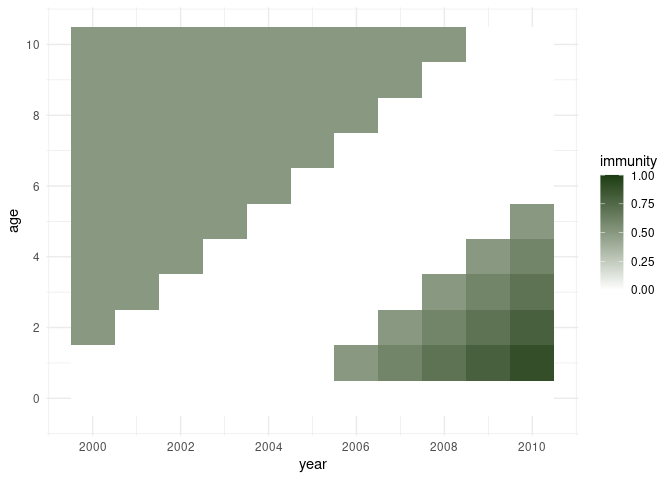

<!-- README.md is generated from README.Rmd. Please edit that file -->

# vip

<!-- badges: start -->

<!-- badges: end -->

**Vaccine Immunity Propagation**

This repository contains functions to run a demographic model of vaccine
exposure over time, tracking the vaccine-derived immunity by age through
time, following implementation of one or more vaccination activities
that can target the population as a whole or selectively target specific
age groups.

## Installation

You can install the development version of vip from
[GitHub](https://github.com/) with:

``` r
# install.packages("devtools")
devtools::install_github("mrc-ide/vip")
```

## Example

This package defines an S3 class “vip\_population” which is a dataframe
with at least the columns year, age, cohort (the year of birth for the
individuals tracked in this row), and immunity (as a proportion of this
cohort). Year, age and cohort are tracked as annual time steps and age
groups.

A basic, totally naive population dataframe can be setup using the
function “vip\_population”:

``` r
library(vip)

pop <- vip_population(year_min = 2000, year_max = 2010,
                        age_min = 0, age_max = 10)

dim(pop)
#> [1] 121   4
head(pop)
#>   year age cohort immunity
#> 1 2000   0   2000        0
#> 2 2001   0   2001        0
#> 3 2002   0   2002        0
#> 4 2003   0   2003        0
#> 5 2004   0   2004        0
#> 6 2005   0   2005        0
```

This dataframe has 121 columns (11 age groups 0 - 10 x 11 years 2000 -
2020).

Next we apply a number of vaccination activities to this population. The
first is a campaign targeting all age groups of our dummy population,
which took place 5 years before the dawn of time. As immunity is assumed
not to wane, the effects of this are still there, and therefore the
functions here keep track of this. The remaining vaccination activities
are routine vaccination of infants (restricted to age 0) with an
increasing population of the target cohort to be vaccinated.

``` r
library(dplyr) ## needed for the pipe %>%
#> 
#> Attaching package: 'dplyr'
#> The following objects are masked from 'package:stats':
#> 
#>     filter, lag
#> The following objects are masked from 'package:base':
#> 
#>     intersect, setdiff, setequal, union

pop <- pop %>%
    apply_vacc(year = 1998, age_first = 0, age_last = 10, coverage = 0.5) %>%
    apply_vacc(year = 2005, age_first = 0, age_last = 0, coverage = 0.5) %>%
    apply_vacc(year = 2006, age_first = 0, age_last = 0, coverage = 0.6) %>%
    apply_vacc(year = 2007, age_first = 0, age_last = 0, coverage = 0.7) %>%
    apply_vacc(year = 2008, age_first = 0, age_last = 0, coverage = 0.8) %>%
    apply_vacc(year = 2009, age_first = 0, age_last = 0, coverage = 0.9) %>%
    apply_vacc(year = 2010, age_first = 0, age_last = 0, coverage = 0.95)
```

The vaccine-derived immunity of the population can be visualised with
the function “plot\_population()”. This is based on ggplot2, and the
returned graph object can be further modified - here in order to achieve
tick marks that suit the data better.

``` r
library(ggplot2) ## needed to amend the plot returned from plot_population()

g <- plot_population(pop)
g + scale_x_continuous(breaks = seq(2000, 2010, by = 2)) +
    scale_y_continuous(breaks = seq(0, 10, by = 2))
```



In the top left corner it shows the immunity remaining in the older age
groups from the initial campaign, while the infant vaccination from 2005
onwards results in immuity in the lower right corner - and the
increasing coverage highlights how cohorts age through time and
therefore move through the plot in a diagonal fashion.

<!-- You'll still need to render `README.Rmd` regularly, to keep -->

<!-- `README.md` up-to-date. `devtools::build_readme()` is handy for -->

<!-- this. You could also use GitHub Actions to re-render `README.Rmd` -->

<!-- every time you push. An example workflow can be found here: -->

<!-- <https://github.com/r-lib/actions/tree/v1/examples>. -->

<!-- You can also embed plots, for example: -->

<!-- ```{r pressure, echo = FALSE} -->

<!-- plot(pressure) -->

<!-- ``` -->

<!-- In that case, don't forget to commit and push the resulting figure -->

<!-- files, so they display on GitHub and CRAN. -->
