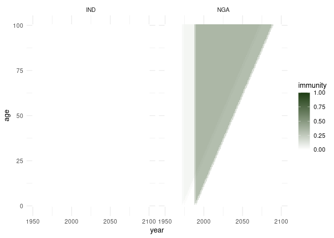
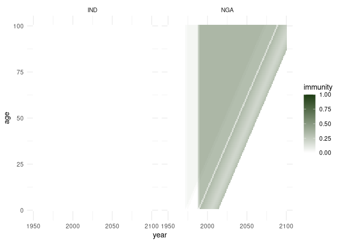
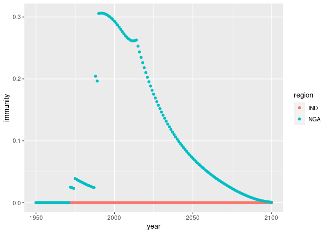

<!-- README.md is generated from README.Rmd. Please edit that file -->

# popim

<!-- badges: start -->

[](https://github.com/mrc-ide/popim/actions/workflows/R-CMD-check.yaml)
<!-- badges: end -->

**POPulation IMmunity**

This repository contains functions to run a demographic model of vaccine
exposure over time, tracking the vaccine-derived immunity by age through
time, following implementation of one or more vaccination activities
that can target the population as a whole or selectively target specific
age groups.

## Installation

You can install the development version of popim from
[GitHub](https://github.com/) with:

``` r
# install.packages("devtools")
devtools::install_github("mrc-ide/popim")
```

## Example 1

This package defines an S3 class `popim_population` which is a dataframe
with at least the columns year, age, cohort (the year of birth for the
individuals tracked in this row), and immunity (as a proportion of this
cohort). Year, age and cohort are tracked as annual time steps and age
groups.

A basic, totally naive population dataframe can be setup using the
function `popim_population()`:

``` r
library(popim)

pop <- popim_population(region = c("UK", "FRA"), year_min = 2000, year_max = 2010,
                        age_min = 0, age_max = 10)

dim(pop)
#> [1] 242   6
head(pop)
#>   region year age cohort immunity pop_size
#> 1     UK 2000   0   2000        0       NA
#> 2    FRA 2000   0   2000        0       NA
#> 3     UK 2001   0   2001        0       NA
#> 4    FRA 2001   0   2001        0       NA
#> 5     UK 2002   0   2002        0       NA
#> 6    FRA 2002   0   2002        0       NA
```

This dataframe has 242 columns (2 regions x 11 age groups 0 - 10 x 11
years 2000 - 2020).

Next, we read in a file containing some vaccination activites into an
object of the class `popim_vacc_activities`.

``` r

vaccs <- read_vacc_activities("inst/extdata/vacc_activities.csv")
vaccs
#>   region year age_first age_last coverage doses targeting
#> 1     UK 1998         0       10     0.50    NA    random
#> 2     UK 2005         0        0     0.50    NA    random
#> 3     UK 2006         0        0     0.60    NA    random
#> 4     UK 2007         0        0     0.70    NA    random
#> 5     UK 2008         0        0     0.80    NA    random
#> 6     UK 2009         0        0     0.90    NA    random
#> 7     UK 2010         0        0     0.95    NA    random
```

All vaccination activities target the UK. The first is a campaign
targeting all age groups of our dummy population, which took place 2
years before the dawn of time. As immunity is assumed not to wane, the
effects of this are still there, and therefore the functions here keep
track of this. The remaining vaccination activities are routine
vaccination of infants (restricted to age 0) with an increasing
population of the target cohort to be vaccinated.

We now apply these vaccination activities sequentially to the population
using the function `apply_vaccs()`.

``` r
pop <- apply_vaccs(pop, vaccs)
```

The resulting vaccine-derived immunity of the population can be
visualised with the function `plot_immunity()`. This is based on
ggplot2, and the returned graph object can be further modified - here in
order to achieve tick marks that suit the data better.

``` r
library(ggplot2) ## needed to amend the plot returned from plot_population()

g <- plot_immunity(pop)
g + scale_x_continuous(breaks = seq(2000, 2010, by = 2)) +
    scale_y_continuous(breaks = seq(0, 10, by = 2))
```


As all vaccination activities target the “UK”, the population in “FRA”
has no immunity at all. In the “UK”, the top left corner it shows the
immunity remaining in the older age groups from the initial campaign,
while the infant vaccination from 2005 onwards results in immuity in the
lower right corner - and the increasing coverage highlights how cohorts
age through time and therefore move through the plot in a diagonal
fashion.

## Example 2

A more realistic scenario is to read in some real population data to set
up the popim\_population, and then apply some vaccination activities to
this. Information on the vaccination activities may be given in coverage
(typical for routine infant vaccination) or doses (typical for mass
vaccination campaigns).

``` r

pop <- read_popim_pop(file = "inst/extdata/pop_sample.csv")
```

We have read in population data for India (“IND”) and Nigeria (“NGA”)
for the period from 1950 to 2100. The age range covered is 0 to 100
year, and the population is set up as fully unvaccinated:

``` r

dim(pop)
#> [1] 30502     6
head(pop)
#>   region year age cohort immunity pop_size
#> 1    IND 1950   0   1950        0 13505495
#> 2    NGA 1950   0   1950        0  1438816
#> 3    IND 1951   0   1951        0 13860960
#> 4    NGA 1951   0   1951        0  1505894
#> 5    IND 1952   0   1952        0 14233779
#> 6    NGA 1952   0   1952        0  1535000

table(pop$region)
#> 
#>   IND   NGA 
#> 15251 15251
range(pop$year)
#> [1] 1950 2100
range(pop$age)
#> [1]   0 100
```

Now we read in some vaccination activities for Nigeria: some campaigns
targeting all age groups, and some routine vaccination targeting only
infants:

``` r
campaigns <- read_vacc_activities("inst/extdata/vacc_campaigns_NGA.csv")
campaigns
#>   region year age_first age_last coverage    doses targeting
#> 1    NGA 1971         0      100       NA  1496674    random
#> 2    NGA 1974         0      100       NA  1100000    random
#> 3    NGA 1987         0      100       NA 17000000    random
#> 4    NGA 1989         0      100       NA 14000000    random

routine <- read_vacc_activities("inst/extdata/vacc_routine_NGA.csv")
routine
#>    region year age_first age_last  coverage doses targeting
#> 1     NGA 1990         0        0 0.3308515    NA    random
#> 2     NGA 1991         0        0 0.3181156    NA    random
#> 3     NGA 1992         0        0 0.3062463    NA    random
#> 4     NGA 1993         0        0 0.2949784    NA    random
#> 5     NGA 1994         0        0 0.2847963    NA    random
#> 6     NGA 1995         0        0 0.2748206    NA    random
#> 7     NGA 1996         0        0 0.2646241    NA    random
#> 8     NGA 1997         0        0 0.2548750    NA    random
#> 9     NGA 1998         0        0 0.2455467    NA    random
#> 10    NGA 1999         0        0 0.2366186    NA    random
#> 11    NGA 2000         0        0 0.2280252    NA    random
#> 12    NGA 2001         0        0 0.2191378    NA    random
#> 13    NGA 2002         0        0 0.2106511    NA    random
#> 14    NGA 2003         0        0 0.2025363    NA    random
#> 15    NGA 2004         0        0 0.1947333    NA    random
#> 16    NGA 2005         0        0 0.1951376    NA    random
#> 17    NGA 2006         0        0 0.2006093    NA    random
#> 18    NGA 2007         0        0 0.2089055    NA    random
#> 19    NGA 2008         0        0 0.2202815    NA    random
#> 20    NGA 2009         0        0 0.2297419    NA    random
#> 21    NGA 2010         0        0 0.2458946    NA    random
#> 22    NGA 2011         0        0 0.2685779    NA    random
#> 23    NGA 2012         0        0 0.2849166    NA    random
#> 24    NGA 2013         0        0 0.3009589    NA    random
```

Note that in this dataset the extent of the campaigns is given in the
number of vaccine doses administered (assuming no wastage, so this
equates to the number of people vaccinated), while the routine
vaccination is given as coverage, i.e., the proportion of the targeted
age cohort to be vaccinated.

If we know the population size that is targeted, we can convert between
doses and coverage, and there is a function `complete_vacc_activities()`
to fill in whichever one is missing:

``` r

campaigns_complete <- complete_vacc_activities(campaigns, pop)
campaigns_complete
#>   region year age_first age_last   coverage    doses targeting
#> 1    NGA 1971         0      100 0.02633246  1496674    random
#> 2    NGA 1974         0      100 0.01798622  1100000    random
#> 3    NGA 1987         0      100 0.19308487 17000000    random
#> 4    NGA 1989         0      100 0.15095306 14000000    random

routine_complete <- complete_vacc_activities(routine, pop)
routine_complete |> head()
#>   region year age_first age_last  coverage   doses targeting
#> 1    NGA 1990         0        0 0.3308515 1252267    random
#> 2    NGA 1991         0        0 0.3181156 1231267    random
#> 3    NGA 1992         0        0 0.3062463 1214359    random
#> 4    NGA 1993         0        0 0.2949784 1201231    random
#> 5    NGA 1994         0        0 0.2847963 1192498    random
#> 6    NGA 1995         0        0 0.2748206 1181349    random
```

We now apply first the campaigns, then the routine vaccination to the
population, and visualise the resulting population immunity. Note that
we can use either the original or completed versions of the vaccination
activities.

``` r

pop <- apply_vaccs(pop, campaigns)
plot_immunity(pop)
```



``` r

pop <- apply_vaccs(pop, routine)
plot_immunity(pop)
```



The overall population immunity can be aggregated across ages using the
function `calc_pop_immunity()`:

``` r
pop_agg <- calc_pop_immunity(pop)
pop_agg
#> # A tibble: 302 × 4
#> # Groups:   region [2]
#>    region  year   pop_size immunity
#>    <chr>  <int>      <dbl>    <dbl>
#>  1 IND     1950 357021100.        0
#>  2 IND     1951 364922360.        0
#>  3 IND     1952 372997188         0
#>  4 IND     1953 381227705         0
#>  5 IND     1954 389731406         0
#>  6 IND     1955 398577992.        0
#>  7 IND     1956 407656597         0
#>  8 IND     1957 416935400.        0
#>  9 IND     1958 426295762.        0
#> 10 IND     1959 435900352.        0
#> # ℹ 292 more rows

ggplot(pop_agg, aes(x = year, y = immunity, col = region)) +
    geom_point()
```



Given a `popim_population` object, the vaccination activities that would
be needed to achieve the specified population immunity can be inferred
with the function `vacc_from_immunity()`, given an assumption on the
targeting method of the vaccination activities. Using this function on
the population we have just constructed does indeed yield the original
vaccination activities back:

``` r

vacc_act <- vacc_from_immunity(pop, targeting = "random")
vacc_act
#>    region year age_first age_last   coverage    doses targeting
#> 1     NGA 1971         0       99 0.02633246  1496674    random
#> 2     NGA 1974         0       99 0.01798622  1100000    random
#> 3     NGA 1987         0       99 0.19308487 16999989    random
#> 4     NGA 1989         0       99 0.15095306 13999990    random
#> 5     NGA 1990         0        0 0.33085152  1252267    random
#> 6     NGA 1991         0        0 0.31811556  1231267    random
#> 7     NGA 1992         0        0 0.30624627  1214359    random
#> 8     NGA 1993         0        0 0.29497841  1201231    random
#> 9     NGA 1994         0        0 0.28479626  1192498    random
#> 10    NGA 1995         0        0 0.27482056  1181349    random
#> 11    NGA 1996         0        0 0.26462412  1163875    random
#> 12    NGA 1997         0        0 0.25487501  1143137    random
#> 13    NGA 1998         0        0 0.24554675  1122657    random
#> 14    NGA 1999         0        0 0.23661858  1112862    random
#> 15    NGA 2000         0        0 0.22802523  1110595    random
#> 16    NGA 2001         0        0 0.21913782  1101837    random
#> 17    NGA 2002         0        0 0.21065106  1090764    random
#> 18    NGA 2003         0        0 0.20253629  1077450    random
#> 19    NGA 2004         0        0 0.19473330  1060944    random
#> 20    NGA 2005         0        0 0.19513761  1089823    random
#> 21    NGA 2006         0        0 0.20060929  1149092    random
#> 22    NGA 2007         0        0 0.20890546  1225697    random
#> 23    NGA 2008         0        0 0.22028150  1326200    random
#> 24    NGA 2009         0        0 0.22974189  1417495    random
#> 25    NGA 2010         0        0 0.24589456  1549583    random
#> 26    NGA 2011         0        0 0.26857787  1728120    random
#> 27    NGA 2012         0        0 0.28491655  1866237    random
#> 28    NGA 2013         0        0 0.30095890  1997462    random
```

<!-- You'll still need to render `README.Rmd` regularly, to keep -->

<!-- `README.md` up-to-date. `devtools::build_readme()` is handy for -->

<!-- this. You could also use GitHub Actions to re-render `README.Rmd` -->

<!-- every time you push. An example workflow can be found here: -->

<!-- <https://github.com/r-lib/actions/tree/v1/examples>. -->

<!-- You can also embed plots, for example: -->

<!-- ```{r pressure, echo = FALSE} -->

<!-- plot(pressure) -->

<!-- ``` -->

<!-- In that case, don't forget to commit and push the resulting figure -->

<!-- files, so they display on GitHub and CRAN. -->
